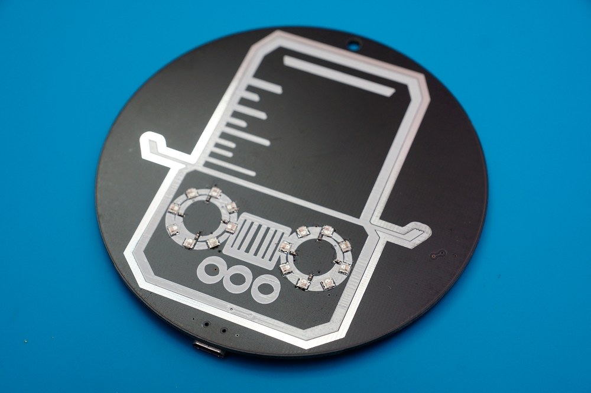

# Dachboden Robot Logo PCB badge


PCB Art badge using 2020 WS2812B SMD LEDs, attiny45 MCU and light_ws2812 library.

Detailed writeup can be found [here](https://etrommer.github.io/projects/electronics/2021/11/06/robot-badge.html)

## Programming

To build the firmware, you need the avr-gcc toolchain and a [USBtinyISP](https://learn.adafruit.com/usbtinyisp) (which you can buy for a few euros on AliExpress etc.)

```bash
cd firmware
make all
```
Then, with the programmer connected to the test points on the back of the badge, run:
```bash
make fuses
make program
```
to flash the firmware onto the badge.
